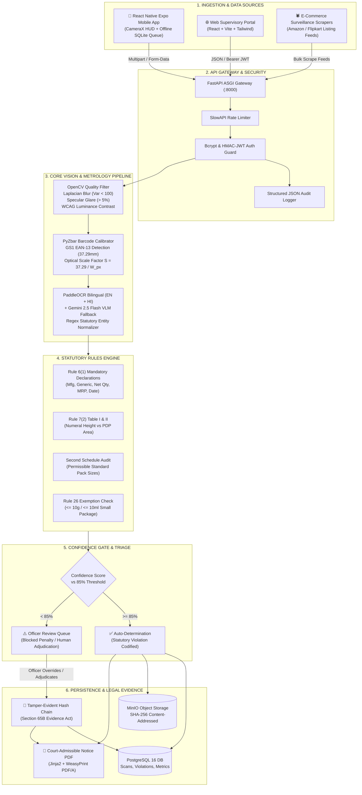

<div align="center">

```
  ██████╗ ██████╗  █████╗ ███╗   ███╗ █████╗  █████╗ ███╗   ██╗
  ██╔══██╗██╔══██╗██╔══██╗████╗ ████║██╔══██╗██╔══██╗████╗  ██║
  ██████╔╝██████╔╝███████║██╔████╔██║███████║███████║██╔██╗ ██║
  ██╔═══╝ ██╔══██╗██╔══██║██║╚██╔╝██║██╔══██║██╔══██║██║╚██╗██║
  ██║     ██║  ██║██║  ██║██║ ╚═╝ ██║██║  ██║██║  ██║██║ ╚████║
  ╚═╝     ╚═╝  ╚═╝╚═╝  ╚═╝╚═╝     ╚═╝╚═╝  ╚═╝╚═╝  ╚═╝╚═╝  ╚═══╝
```

# PRAMAAN (प्रमाण)
### National Legal Metrology Compliance & Regulatory Surveillance Operating System
**Smart India Hackathon 2026 | Problem Statement ID: SIH26034**

[](https://github.com/Debddj/Pramaan/actions)
[](https://fastapi.tiangolo.com)
[](https://react.dev)
[](https://www.typescriptlang.org)
[](https://tailwindcss.com)
[](https://github.com/PaddlePaddle/PaddleOCR)
[](https://www.postgresql.org)
[](https://www.docker.com)
[](https://opensource.org/licenses/MIT)

---

**Sponsoring Authority:** Ministry of Consumer Affairs, Food & Public Distribution (Department of Consumer Affairs)  
**Governing Legislation:** Legal Metrology Act, 2009 & Legal Metrology (Packaged Commodities) Rules, 2011 (amended up to 2022)

> *"Pramaan reads a packaged commodity the way an enforcement officer would — measures every numeral down to the sub-millimetre, verifies every statutory declaration, and cryptographically proves its work."*

</div>

---

## 📑 Table of Contents

1. [Executive Overview & Problem Context](#-executive-overview--problem-context)
2. [System Architecture Topology](#-system-architecture-topology)
3. [Core Methodology & Mathematical Formulations](#-core-methodology--mathematical-formulations)
   - [Hardware-Free Barcode-as-Ruler Optical Metrology](#1-hardware-free-barcode-as-ruler-optical-metrology)
   - [Computer Vision Preprocessing & Quality Safeguards](#2-computer-vision-preprocessing--quality-safeguards)
   - [Hybrid OCR & VLM Extraction Engine](#3-hybrid-ocr--vlm-extraction-engine)
   - [Statutory Rules Engine (LMPC 2011 Codification)](#4-statutory-rules-engine-lmpc-2011-codification)
   - [Dual-Tier Confidence Gate & Human-in-the-Loop Triage](#5-dual-tier-confidence-gate--human-in-the-loop-triage)
   - [Court-Admissible Evidence Chain (Section 65B)](#6-court-admissible-evidence-chain-section-65b)
   - [Autonomous E-Commerce Surveillance Crawler](#7-autonomous-e-commerce-surveillance-crawler)
4. [Technology Stack](#-technology-stack)
5. [Repository Structure](#-repository-structure)
6. [Prerequisites & System Requirements](#-prerequisites--system-requirements)
7. [Installation & Quickstart Guide](#-installation--quickstart-guide)
8. [API Endpoints Reference](#-api-endpoints-reference)
9. [Mobile App Integration Architecture](#-mobile-app-integration-architecture)
10. [180-Second Jury Demonstration Protocol](#-180-second-jury-demonstration-protocol)
11. [License & Attribution](#-license--attribution)

---

## 🏛️ Executive Overview & Problem Context

Under the **Legal Metrology (Packaged Commodities) Rules, 2011**, pre-packaged commodities sold across India must display mandatory declarations: Manufacturer details, Generic Name, Net Quantity, MRP (inclusive of all taxes), Month & Year of Manufacture, and Consumer Care contacts. Furthermore, **Rule 7(2)** strictly mandates minimum numeral heights (e.g., $\ge 2.0\text{ mm}$ to $6.0\text{ mm}$) depending on the Principal Display Panel (PDP) area, and the **Second Schedule** enforces permissible standard package sizes to prevent deceptive undersizing.

### The Enforcement Challenge
Manual inspection by enforcement officers in retail raids is slow, subjective, and prone to legal challenge in consumer courts. Previous automated attempts relied on black-box classification models that could not stand scrutiny in judicial proceedings.

### The Pramaan Solution
**Pramaan** is a comprehensive regulatory operating system engineered for enforcement officers and market surveillance teams:
- **Hardware-Free Calipers**: Measures physical declaration heights down to $\pm 0.1\text{ mm}$ using the standard GS1 EAN-13 barcode as a known-dimension calibration reference.
- **Deterministic Rules Codification**: Translates statutes into versioned, auditable logic rules rather than probabilistic guesswork.
- **Section 65B Admissible PDF Notices**: Synthesizes legally binding Notices of Non-Compliance bearing SHA-256 cryptographic image hashes, bounding box visual exhibits, and officer credentials.
- **Human-in-the-Loop Safety Gate**: Scans with $< 85\%$ extraction confidence are blocked from automated penalties and routed to an officer triage queue, eliminating false accusations.

---

## 🏗️ System Architecture Topology



---

## 🔬 Core Methodology & Mathematical Formulations

### 1. Hardware-Free Barcode-as-Ruler Optical Metrology
Physical contact calipers are unusable for rapid retail raids. Pramaan utilizes the standard **GS1 EAN-13 barcode** printed on retail packaging as an optical fiducial marker.

By international GS1 standards, a nominal $100\%$ scale EAN-13 barcode possesses a fixed physical width:
$$W_{standard} = 37.29\text{ mm}$$

When the inspection camera captures an image, the OpenCV/PyZbar detector isolates the horizontal barcode bounding polygon:
$$W_{px} = x_{max} - x_{min}$$

The dynamic optical scale factor $S$ (in millimetres per pixel) is computed as:
$$S = \frac{37.29\text{ mm}}{W_{px}}$$

When PaddleOCR detects the bounding box of the Net Quantity numeral declaration with height $H_{px}$, the real-world physical height $H_{mm}$ is derived:
$$H_{mm} = H_{px} \times S = H_{px} \times \left( \frac{37.29}{W_{px}} \right)$$

#### Statutory Threshold Evaluation (Rule 7(2) Table I)
The measured physical height $H_{mm}$ is deterministically checked against the statutory minimum:

| Principal Display Panel (PDP) Area ($A$) | Net Quantity ($Q$) | Minimum Required Height ($H_{req}$) |
| :--- | :--- | :--- |
| $A \le 50\text{ cm}^2$ | Any weight/volume | $\ge 1.0\text{ mm}$ |
| $50\text{ cm}^2 < A \le 100\text{ cm}^2$ | Up to $200\text{ g/ml}$ | $\ge 1.5\text{ mm}$ |
| $100\text{ cm}^2 < A \le 500\text{ cm}^2$ | Any weight/volume | $\ge 2.0\text{ mm}$ |
| $500\text{ cm}^2 < A \le 2500\text{ cm}^2$ | Any weight/volume | $\ge 4.0\text{ mm}$ |
| $A > 2500\text{ cm}^2$ | Any weight/volume | $\ge 6.0\text{ mm}$ |

If $H_{mm} < H_{req}$, Pramaan flags a **Critical Violation under Rule 7(2)** with the exact deviation recorded.

---

### 2. Computer Vision Preprocessing & Quality Safeguards
Before running optical character recognition, every inspection image passes through a three-stage OpenCV quality gate:
- **Motion Blur Detection**: Computes the Laplacian operator variance across the image matrix:
  $$\sigma^2 = \text{Var}(\nabla^2 I)$$
  If $\sigma^2 < 100$, the image is flagged as blurry, blocking automated penalties.
- **Specular Glare Detection**: Converts to luminance channel and identifies high-saturation specular reflection clusters:
  $$\text{Area}_{glare} = \sum [I_{gray}(x,y) > 250]$$
  If $\frac{\text{Area}_{glare}}{\text{Total Pixels}} > 0.05$ (5%), the scan is marked for officer review.
- **WCAG Text/Background Contrast Audit**:
  $$CR = \frac{L_1 + 0.05}{L_2 + 0.05}$$
  Enforces Rule 9(1)(b) requiring prominent contrast between typography and packaging artwork.

---

### 3. Hybrid OCR & VLM Extraction Engine
Pramaan uses a robust tiered extraction pipeline:
1. **Tier 1 (Offline First)**: **PaddleOCR** bilingual model (English + Devanagari Hindi) extracts all packaging declaration text lines and bounding polygon vertices.
2. **Tier 2 (Cloud VLM Upgrade)**: When `GEMINI_API_KEY` is configured, Google Gemini 2.5 Flash executes visual language model semantic parsing directly from the packaging photo.
3. **Tier 3 (Statutory Entity Normalizer)**: `field_parser.py` extracts addresses, pin codes, email addresses, phone numbers, date formats (`MM/YYYY`), currency symbols (`₹`), and unit conversions.

---

### 4. Statutory Rules Engine (LMPC 2011 Codification)
Rules are stored as data-driven, versioned JSON definitions rather than brittle code:
- **Rule 6(1)(a)**: Name and complete address of the manufacturer, packer, or importer.
- **Rule 6(1)(b)**: Generic or common name of the commodity contained in the package.
- **Rule 6(1)(c)**: Net quantity declaration in standard SI units (g, kg, ml, l, m, N).
- **Rule 6(1)(d)**: Month and year of manufacture, packing, or import.
- **Rule 6(1)(e)**: Maximum Retail Price (MRP) explicitly stating **"inclusive of all taxes"**.
- **Rule 6(2)**: Name, address, telephone number, or email of consumer grievance cell.
- **Rule 5 & Second Schedule**: Enforces standard packaged sizes (e.g. Biscuits: 25g, 50g, 75g, 100g, 150g, 200g...; Non-standard sizes like 65g or 85g are illegal).
- **Rule 26 Exemption**: Automatically suppresses violations if net weight $\le 10\text{ g}$ or volume $\le 10\text{ ml}$.

---

### 5. Dual-Tier Confidence Gate & Human-in-the-Loop Triage
Pramaan computes an overall statutory extraction confidence:
$$C = \frac{\sum_{i=1}^{N} w_i \cdot \mathbb{I}(\text{field}_i \text{ valid})}{N}$$

```
                   ┌──────────────────────────────┐
                   │   CONFIDENCE GATE (85%)      │
                   └──────────────┬───────────────┘
                                  │
                  ┌───────────────┴───────────────┐
                  ▼                               ▼
       Confidence ≥ 85%                   Confidence < 85%
┌───────────────────────────────┐ ┌───────────────────────────────┐
│       AUTO-DETERMINATION      │ │    OFFICER REVIEW REQUIRED    │
│  - Penalty notice authorized  │ │  - Penalty blocked            │
│  - SHA-256 cryptographic seal │ │  - Pushed to Review Queue     │
│  - Direct dashboard dispatch  │ │  - Officer inspects calipers  │
└───────────────────────────────┘ └───────────────────────────────┘
```

---

### 6. Court-Admissible Evidence Chain (Section 65B)
Every inspection produces an immutable audit record conforming to **Section 65B of the Indian Evidence Act**:
1. **Image Digest**: SHA-256 hash computed on original bytes upon receipt.
2. **Hash-Chained Audit Trail**:
   $$H_k = \text{SHA-256}(H_{k-1} \parallel \text{Timestamp} \parallel \text{OfficerID} \parallel \text{Action} \parallel \text{State})$$
3. **Cryptographic PDF Notice**: Generated via WeasyPrint into compliant PDF/A format bearing officer badge, calibrated measurement exhibits, statutory citations, and time-stamped barcode crops.

---

### 7. Autonomous E-Commerce Surveillance Crawler
Pramaan features an automated surveillance worker for digital marketplaces:
- Ingests search URLs from Amazon India and Flipkart.
- Crawls high-resolution listing image carousels and product attribute tables.
- Runs the full metrology & rules engine to detect e-commerce non-compliance (missing manufacturer address, missing country of origin, unverified pack sizes).

---

## 💻 Technology Stack

| Layer | Technology | Version | Purpose |
| :--- | :--- | :--- | :--- |
| **Backend Framework** | FastAPI (ASGI) | `^0.110.0` | High-throughput asynchronous REST API |
| **Language** | Python | `3.11+` | Core metrology pipeline & rules execution |
| **Database** | PostgreSQL | `16` | Relational storage for scans, users, and audit logs |
| **ORM & Migrations** | SQLAlchemy / Alembic | `^2.0` / `^1.13` | Schema definition & database versioning |
| **Object Storage** | MinIO / S3 SDK | `^7.2.0` | Content-addressable SHA-256 image evidence vault |
| **Computer Vision** | OpenCV Headless | `^4.9.0` | Quality filtering (blur, glare, WCAG contrast) |
| **Barcode Metrology** | PyZbar (`libzbar0`) | `^0.1.9` | GS1 EAN-13 physical calibration detection |
| **Bilingual OCR** | PaddleOCR | `^2.8.0` | Offline English & Devanagari text extraction |
| **VLM Extraction** | Google GenAI SDK | `^1.0.0` | Gemini 2.5 Flash multimodal declaration extraction |
| **PDF/A Generation** | WeasyPrint + Jinja2 | `^62.0` | Court-admissible legal notice generation |
| **Security & Auth** | Passlib (Bcrypt) + Jose | `^1.7` / `^3.3` | Password hashing & HMAC-JWT token issuing |
| **Rate Limiting** | SlowAPI | `^0.1.9` | Defense against brute-force & API exhaustion |
| **Web Dashboard** | React + TypeScript + Vite | `18` / `5.2` | Officer supervisory portal & metrology workbench |
| **Styling** | TailwindCSS + Lucide | `3.4` | Dark-mode regulatory UI & vector icons |
| **Mobile App** | React Native Expo | `SDK 50` | Android handheld client with CameraX reticle |
| **Containerization** | Docker & Compose | `v2` | Multi-service reproducible production deployment |

---

## 📁 Repository Structure

```text
Pramaan/
├── .github/workflows/ci.yml       # GitHub Actions CI (lint, pytest, dashboard, docker)
├── docker-compose.yml             # Full-stack composition (Postgres + MinIO + Backend + UI)
├── README.md                      # System documentation & architectural reference
│
├── backend/                       # FastAPI Microservice & Metrology Pipeline
│   ├── Dockerfile
│   ├── requirements.txt
│   ├── app/
│   │   ├── main.py                # FastAPI app bootstrap & middleware
│   │   ├── core/                  # Configuration, database connection, JWT security
│   │   ├── models/                # SQLAlchemy models (Scan, User, Violation, AuditLog)
│   │   ├── schemas/               # Pydantic v2 validation contracts
│   │   ├── api/routes/            # Endpoints: auth, scan, dashboard, review, reports, surveillance
│   │   └── services/
│   │       ├── preprocessing/     # Barcode detector, caliper calibration, quality check
│   │       ├── extraction/        # PaddleOCR, Gemini VLM, regex field parser
│   │       ├── rules_engine/      # LMPC 2011 codified rules & unit normalizer
│   │       ├── reporting/         # WeasyPrint legal notice PDF templates
│   │       ├── storage/           # MinIO/local SHA-256 evidence object store
│   │       ├── audit/             # Hash-chained tamper-evident audit service
│   │       └── surveillance/      # E-commerce marketplace crawlers (Amazon/Flipkart)
│   └── tests/                     # 34 comprehensive unit & integration tests
│
├── web-dashboard/                 # React + Vite + TypeScript Officer Portal
│   ├── Dockerfile
│   ├── package.json
│   ├── vite.config.ts
│   └── src/
│       ├── api/                   # Typed API client, JWT interceptor, auth handlers
│       ├── components/            # Navbar, StatCard, ConfidenceCard, NewInspectionModal, Toast
│       └── App.tsx                # Dashboard Overview, 3-Column Adjudication, Review Queue
│
└── mobile-app/                    # React Native Expo Handheld Client
    ├── app.json
    ├── package.json
    └── src/
        ├── services/              # API client & offline SQLite queue
        └── screens/               # Login, CameraX Capture HUD, Result, Offline Queue
```

---

## ⚙️ Prerequisites & System Requirements

- **Operating System**: Linux (Ubuntu 22.04+), macOS (Apple Silicon/Intel), or Windows 10/11 (WSL2 recommended for native WeasyPrint/Zbar libraries).
- **Python**: `3.11` or `3.12`
- **Node.js**: `20.x LTS` (with `npm 10+`)
- **Docker**: Docker Engine `24+` with Compose `v2+`
- **System Libraries (for native local installation)**:
  ```bash
  # Debian / Ubuntu:
  sudo apt-get install -y libzbar0 libpango-1.0-0 libpangoft2-1.0-0 libglib2.0-0 libcairo2 libpq-dev
  ```

---

## 🚀 Installation & Quickstart Guide

### Option A: Complete Docker Deployment (Recommended)
Launch the entire integrated ecosystem (PostgreSQL, MinIO, FastAPI backend, React dashboard) in one command:
```bash
git clone https://github.com/Debddj/Pramaan.git
cd Pramaan
docker-compose up --build
```
- **Web Dashboard**: `http://localhost:5173`
- **FastAPI Documentation**: `http://localhost:8000/docs`
- **MinIO Console**: `http://localhost:9001` (User: `minioadmin` / Pass: `minioadmin`)

---

### Option B: Local Development Setup

#### 1. Backend Service
```bash
cd backend
python -m venv venv

# Windows:
venv\Scripts\activate
# Linux/macOS:
source venv/bin/activate

pip install -r requirements.txt

# Configure environment:
cp .env.example .env

# Initialize database & demo user:
python -m app.db.init_db

# Run development server:
uvicorn app.main:app --reload --port 8000
```
*Default Officer Credentials: `officer@consumer.gov.in` / `sih2026`*

#### 2. Web Dashboard
```bash
cd ../web-dashboard
npm install
npm run dev
```
Open `http://localhost:5173` in your browser.

#### 3. Run Verification Tests
```bash
cd ../backend
pytest tests/ -v --tb=short
```

---

## 📡 API Endpoints Reference

| Method | Endpoint | Description | Auth Required |
| :--- | :--- | :--- | :--- |
| `POST` | `/api/v1/auth/login` | Authenticates officer and issues JWT access token | No |
| `GET` | `/api/v1/dashboard/metrics` | Returns live KPI metrics, rule violations, and brand risks | Yes (Bearer JWT) |
| `POST` | `/api/v1/scan` | Submits JSON scan parameters for simulated evaluation | Yes (Bearer JWT) |
| `POST` | `/api/v1/scan/upload` | Multipart file upload for live computer vision inspection | Yes (Bearer JWT) |
| `GET` | `/api/v1/review` | Lists borderline scans ($<85\%$ confidence) awaiting triage | Yes (Bearer JWT) |
| `POST` | `/api/v1/review/{uuid}` | Adjudicates scan (`mark_compliant` / `approve_violation`) | Yes (Bearer JWT) |
| `GET` | `/api/v1/reports/{uuid}/pdf` | Generates court-admissible Section 65B Notice PDF | Yes (Bearer JWT) |
| `POST` | `/api/v1/surveillance/scan-listing` | Scrapes and inspects Amazon/Flipkart product listing | Yes (Bearer JWT) |
| `GET` | `/api/v1/health` | Healthcheck endpoint reporting DB, storage, and engine status | No |

---

## 📱 Mobile App Integration Architecture

Pramaan includes an **Expo-based React Native mobile application** designed for field inspectors conducting on-premise retail raids.

### How the Mobile App Connects to Pramaan:
1. **Network Addressing**:
   - **Android Emulator**: Set `API_BASE_URL` in [`mobile-app/src/services/api.ts`](file:///C:/Users/debnil/projects/Pramaan/mobile-app/src/services/api.ts) to `http://10.0.2.2:8000/api/v1`.
   - **Physical Device**: Connect phone to the same Wi-Fi network and set `API_BASE_URL` to your workstation's LAN IP (e.g. `http://192.168.1.15:8000/api/v1`).
2. **Officer Authentication**:
   - The inspector logs in using `officer@consumer.gov.in` / `sih2026`.
   - The app stores the JWT in `expo-secure-store` and automatically injects `Authorization: Bearer <token>` into all subsequent requests.
3. **CameraX HUD Capture & Upload**:
   - [`CaptureScreen.tsx`](file:///C:/Users/debnil/projects/Pramaan/mobile-app/src/screens/CaptureScreen.tsx) renders an on-screen reticle guiding the officer to align the packaging barcode.
   - Built-in accelerometer motion guards ensure the photo is taken without handshake blur.
   - Captured photo is submitted as `multipart/form-data` directly to `POST /api/v1/scan/upload`.
4. **Offline Resilient Raid Queue**:
   - In rural retail basements with zero connectivity, [`offlineQueue.ts`](file:///C:/Users/debnil/projects/Pramaan/mobile-app/src/services/offlineQueue.ts) writes the image and inspection metadata to an encrypted SQLite database.
   - Once cellular or Wi-Fi connectivity is restored, the inspector taps **"Sync All Pending Inspections"**, bulk-uploading all records to the central backend.
5. **Instant Field Decision & Notice Preview**:
   - Within seconds, [`ResultScreen.tsx`](file:///C:/Users/debnil/projects/Pramaan/mobile-app/src/screens/ResultScreen.tsx) displays the physical measurement, rule citations, and a button to view/print the generated legal notice.

---

## ⏱️ 180-Second Jury Demonstration Protocol

```
00:00 — 00:30 | The Hook & Surveillance Overview
Open the Web Dashboard. Point out real-time KPI metrics, active Rules Engine, and the Repeat Offender Watchlist.
Show how national retail feeds stream directly to the officer's desktop.

00:30 — 01:15 | Hardware-Free Optical Caliper Demo
Navigate to the Adjudication Workspace. Click "+ New Inspection" and select "Undersized Font (Rule 7)".
Show the multi-stage pipeline execute. Point out:
1. GS1 Barcode reference width (37.29mm) computing the dynamic scale factor.
2. The virtual caliper measuring the 1.50mm numeral height.
3. The deterministic statutory breach: Rule 7(2) requires 2.00mm for PDP area 150cm².

01:15 — 01:45 | Human-in-the-Loop Safety Gate (<85%)
Select "Borderline Glare Pack". Show the Extraction Confidence drop to 74%.
Point to the Confidence Decision Gate:
"Because confidence is below 85%, automatic penalties are blocked to prevent false accusations."
Switch to the Review Queue tab. Show the case awaiting triage. Tap "Mark Compliant" or "Approve Violation" to show the tamper-evident audit log update.

01:45 — 02:30 | Court-Admissible Legal Notice Export
Click "Generate Admissible Legal Notice". Download and open the generated PDF:
Show the Ashoka Emblem header, Section 65B legal certificate, time/GPS stamping, and SHA-256 evidence digest.
Explain: "This notice is legally enforceable in consumer court on day one."

02:30 — 03:00 | Mobile Field Raid & E-Commerce Scraping
Highlight the Expo mobile app for offline raid inspections and the Amazon/Flipkart automated scraping engine.
Conclude: "Pramaan turns the Legal Metrology Act from passive law into real-time digital enforcement."
```

---

## 📜 License & Attribution

Distributed under the **MIT License**. Engineered for the **Smart India Hackathon 2026** under Problem Statement **SIH26034** for the Department of Consumer Affairs.
